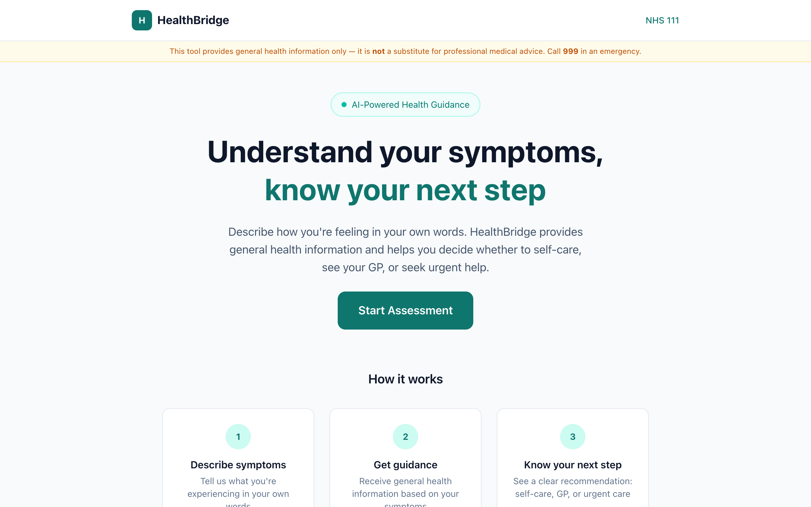

# HealthBridge — AI Symptom Triage Assistant

An AI-powered health information assistant that helps users understand their symptoms and decide on next steps — built with RAG, tool use, multi-step agents, and real-time streaming.

> **Not medical advice.** HealthBridge provides general health information only. Call 999 for emergencies.

**[Live Demo](https://healthbridge-app.vercel.app)** · Built by [Gian Pierre](https://github.com/gianlpz)



---

## AI Concepts Demonstrated

This project showcases core AI engineering patterns — not just calling an API, but building a reasoning agent with retrieval, tools, and safety constraints.

### RAG (Retrieval-Augmented Generation)

6 health knowledge documents are loaded from markdown files, split by `##` headings into chunks, and embedded using Google's `text-embedding-004` model. When the agent needs information, it embeds the query, computes cosine similarity against all chunks, and retrieves the top 3 most relevant passages. This gives the model grounded, factual context instead of relying on training data alone.

### Tool Use / Function Calling

The agent has 3 tools it can invoke autonomously:

| Tool | Purpose | How it works |
|------|---------|--------------|
| `searchHealthInfo` | RAG-powered knowledge lookup | Embeds the query, searches the vector store, returns relevant passages |
| `checkSymptomInteractions` | Symptom combination checker | Looks up dangerous symptom pairs (e.g., headache + fever + stiff neck → meningitis risk) |
| `assessSeverity` | Rule-based severity scoring | Takes duration + pain level, returns LOW/MODERATE/HIGH with recommendations |

### Multi-Step Agent

The model doesn't just make one tool call — it reasons across multiple steps. For example, given "I've had a headache and fever for 5 days, pain is 7/10", the agent might:

1. **Step 1:** Call `searchHealthInfo("headache with fever")` → retrieves knowledge
2. **Step 2:** Call `checkSymptomInteractions(["headache", "fever"])` → checks for dangerous combinations
3. **Step 3:** Call `assessSeverity("headache", 5, 7)` → scores severity
4. **Step 4:** Synthesize all tool results into a single, coherent triage response

The agent decides which tools to use and in what order — it's not a hardcoded pipeline.

### Streaming

Responses stream token-by-token to the UI using the Vercel AI SDK's `streamText` and `useChat`. Users see the response being written in real time, which is critical for a conversational health assistant where waiting feels especially long.

### Prompt Engineering

The system prompt implements a safety-first triage framework with three levels:

- **GREEN** — Self-care appropriate (rest, hydration, OTC remedies)
- **AMBER** — See a GP within days
- **RED** — Emergency, call 999 immediately

The prompt also defines multi-step agent behavior: when to use tools, when to ask follow-up questions, and when to skip tools entirely (e.g., chest pain → immediate RED triage).

---

## How It Works

```
User describes symptoms
        ↓
  System prompt guides the agent
        ↓
  Agent calls tools as needed:
    → searchHealthInfo (RAG lookup)
    → checkSymptomInteractions (combo check)
    → assessSeverity (rule-based scoring)
        ↓
  Agent synthesizes tool results
        ↓
  Streams triage response with GREEN / AMBER / RED level
```

---

## Tech Stack

| Technology | Role |
|-----------|------|
| [Next.js 16](https://nextjs.org) | React framework (App Router, server components) |
| [Vercel AI SDK v6](https://sdk.vercel.ai) | `streamText`, `tool()`, `useChat`, `stepCountIs` |
| [Google Gemini 2.5 Flash](https://ai.google.dev) | LLM for reasoning + `text-embedding-004` for embeddings |
| [Tailwind CSS v4](https://tailwindcss.com) | Styling |
| [Zod](https://zod.dev) | Tool input schema validation |

---

## Getting Started

```bash
# Clone the repo
git clone https://github.com/gianlpz/healthbridge.git
cd healthbridge

# Install dependencies
npm install

# Add your Google AI API key
echo "GOOGLE_GENERATIVE_AI_API_KEY=your-key-here" > .env.local

# Start the dev server
npm run dev
```

Open [http://localhost:3000](http://localhost:3000) to see the app.

You can get a free API key at [aistudio.google.com](https://aistudio.google.com/apikey).

---

## Project Structure

```
src/
├── app/
│   ├── api/chat/
│   │   ├── route.ts              # API route — system prompt, model config, 3 tools
│   │   ├── rag.ts                # RAG module — load docs, embed, cosine similarity search
│   │   └── knowledge/            # 6 health topic markdown files
│   │       ├── headaches.md
│   │       ├── sore-throat.md
│   │       ├── stomach-pain.md
│   │       ├── dizziness.md
│   │       ├── knee-pain.md
│   │       └── fever.md
│   ├── chat/
│   │   └── page.tsx              # Chat UI — useChat, message list, symptom cards
│   ├── components/
│   │   ├── Header.tsx            # App header with logo
│   │   ├── ChatMessage.tsx       # Message bubble with triage badge rendering
│   │   ├── ChatInput.tsx         # Input bar with send button
│   │   ├── SymptomCard.tsx       # Clickable symptom suggestion cards
│   │   ├── TriageResult.tsx      # GREEN/AMBER/RED triage badge
│   │   └── DisclaimerBanner.tsx  # Medical disclaimer banner
│   ├── page.tsx                  # Landing page with hero and "How it works"
│   ├── layout.tsx                # Root layout
│   └── globals.css               # Tailwind + custom theme
```

---

## What I Learned

*Building HealthBridge taught me the difference between calling an AI API and building an AI agent.*

A simple chatbot sends a message and gets a response. An agent has tools, retrieves context, reasons across multiple steps, and decides its own workflow. I learned how RAG gives the model grounded knowledge instead of hallucinations, how tool use lets the model take actions (not just generate text), and how prompt engineering shapes the agent's behavior and safety boundaries.

The biggest insight: the system prompt isn't just instructions — it's the architecture. It defines what the agent can do, how it reasons, and when it should stop and escalate. That's the difference between a toy demo and something that could actually help someone.
